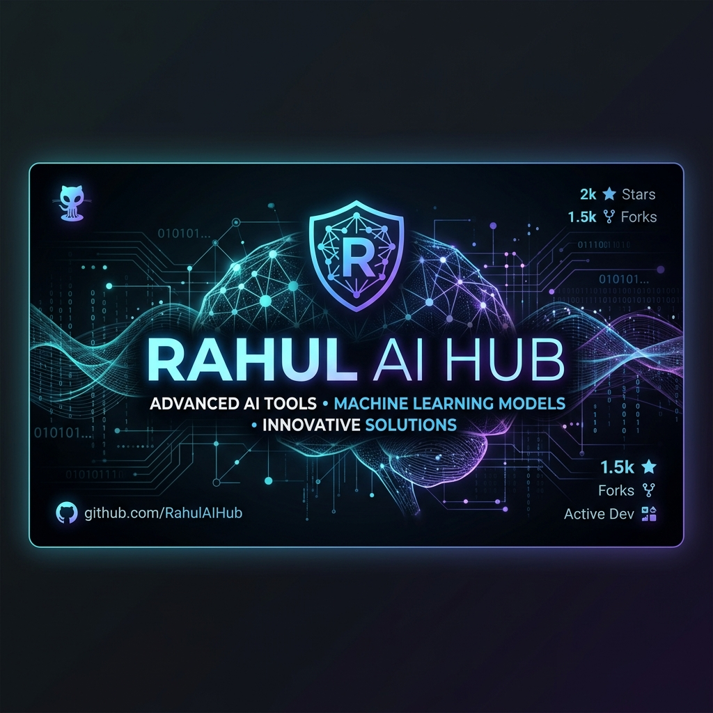

<div align="center">
  
  
  <br />
  <h1>Rahul AI</h1>
  <p><strong>The backend code and terminal interface for my personal AI projects.</strong></p>
  <br />
</div>

## Overview

This repository holds the code for my personal AI tools. I built this to keep my AI backend logic in one place instead of scattering it across different repos. Right now, it powers **Zero** (the chatbot you can talk to on my portfolio) and includes a local terminal UI I use for testing.

---

## What's Inside

### `1. zero-backend/`
This is a FastAPI backend that runs the **Zero** chatbot on my portfolio website. 
- It uses Gemini by default, with an automatic fallback to xAI (Grok) if Gemini goes down.
- Streams responses in real-time.
- Has basic rate-limiting to prevent spam.

### `2. ZERO_Core/`
A local terminal UI (TUI) I use for testing models and scripts without needing a web browser.
- Built with Python and Textual.
- Connects directly to local models running via Ollama.

---

## Running the Backend Locally

If you want to spin up the backend API on your own machine:

```bash
# Move into the backend folder
cd zero-backend

# Setup a virtual environment
python3 -m venv .venv
source .venv/bin/activate

# Install the required packages
pip install -r requirements.txt

# Start the API server
uvicorn main:app --host 0.0.0.0 --port 8000
```

The API will be live at `http://localhost:8000/api/chat`.

---

## Environment Variables
To run the backend, create a `.env` file in the `zero-backend/` folder with your API keys:
```env
GOOGLE_GENERATIVE_AI_API_KEY=your_gemini_key
GROQ_API_KEY=your_grok_key
```

---

## License

This project is proprietary. All rights reserved. See the [LICENSE](LICENSE) file for more information.
